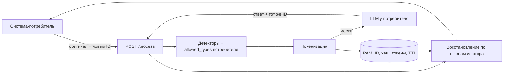

# AlfaGen PII Proxy

Модуль безопасности персональных данных для хакатона AlfaGen: находит ПДн в
тексте, маскирует их токенами до отправки в LLM и восстанавливает исходные
значения в ответе модели. Трафик: «система-потребитель → LLM →
система-потребитель». Единственная точка обработки: `POST /process` →
`{"result":"..."}`. Направление (маскирование/демаскирование) определяется
тем, новый `payload_id` в запросе или уже виденный — отдельного поля для
этого в контракте нет.

Код (детекторы, стор, HTTP-слой, конфигурация, нагрузочный клиент, Docker,
скрипты) сгенерирован промптами к **DeepSeek-V4-Flash-0731** через Kilo
Code — пошагово, с проверкой `go build`/`go vet`/`go test` после каждого
шага. Этот README и
структура проекта готовились отдельно.

## Результаты

| Проверка | Результат |
|---|---|
| Нагрузочные прогоны проверяющей системы (23.09, по логам сервиса) | 520 тыс. запросов за 8 минут, пики до 4100 RPS: все ответы `200`, 0 ответов `429`, 0 ошибок, 0 перезапусков |
| Время обработки в сервисе (без сети) | p50 0,05 мс, p95 0,37 мс, p99 0,85 мс |
| Ресурсы | 2 vCPU, ≈600 МБ памяти под нагрузкой |
| Статический анализ архива решения | 9980 из 10000: 2 замечания о когнитивной сложности (`trimAddress`, `issuingAuthorityDetectorImpl.Find`) |
| Восстановление | тексты до ≈400 тыс. символов (≈100 тыс. токенов) восстанавливаются без расхождений |
| Идемпотентность | повторное маскирование с тем же `payload_id` возвращает ту же маску |

## Структура

```
cmd/piiproxy/      точка входа сервиса
cmd/loadtest/      нагрузочный клиент по методике проверяющей системы
internal/pii/      типы ПДн, детекторы, маскирование и восстановление
internal/store/    хранилище соответствий в памяти с TTL и лимитами
internal/httpapi/  POST /process, авторизация, метрики, логи
internal/config/   конфигурация систем-потребителей (consumers.yaml)
scripts/           сборка архива решения
```

## Запуск

Нужен Go 1.24+ или Docker Compose. Скопируйте `.env.example` в `.env`,
задайте ключ потребителя и выполните `docker compose up -d --build`.
Для Go задайте переменные окружения в оболочке и выполните
`go run ./cmd/piiproxy`; Go сам `.env` не читает.

```bash
curl http://127.0.0.1:8080/process -H 'Content-Type: application/json' \
  -H "X-API-Key: $LOADTEST_API_KEY" \
  -d '{"payload":"Клиент Иванов Иван Иванович, паспорт 4509 123456","payload_id":"demo-1"}'
```

Отправьте полученный `result` как `payload` с тем же `payload_id` и ключом:
сервис восстановит исходный текст. Повторный запрос с исходным `payload`
и тем же `payload_id` возвращает ту же маску (идемпотентность). Для
проверяющей системы без заголовков задайте `PUBLIC_CONSUMER` — тогда
запросы без `X-API-Key`/`Authorization` авторизуются под этим id.

## Настройка систем-потребителей — 5 предложений

1. Добавьте в `consumers.yaml` систему с уникальным `id` и `api_key_env`, а секрет задайте в одноимённой переменной окружения.
2. Поле `enabled` включает или отключает доступ системы; запросы передают ключ в `X-API-Key` либо `Authorization: Bearer`.
3. В `allowed_types` перечислите типы для маскирования, а пустой список означает все типы.
4. Флаг `unmask_enabled` разрешает или запрещает обратное восстановление для этой системы.
5. После изменения настроек перезапустите сервис, учитывая потерю текущих соответствий токенов при рестарте (состояние хранится только в памяти).

## Типы и расширение

`full_name`, `cardholder_name`, `birth_date`, `birth_place`, `passport_number`,
`citizenship`, `issuing_authority`, `department_code`, `passport_issue_date`,
`driver_license_number`, `address`, `postal_code`, `country`, `city`, `street`,
`house_flat`, `email`, `phone`, `inn`, `card_number`, `cvv`, `pin`.

Детекторы реализуют интерфейс `pii.Detector` (`Type() Type`, `Find(text) []Entity`)
и собираются в `pii.Registry()`; новый тип добавляется без изменения
HTTP-слоя и хранилища. Свободные ФИО без меток (например "Иван Петров
прислал письмо") распознаются словарём распространённых имён + эвристикой
окончания фамилии; отчества в родительном/дательном/творительном падеже
("Иванова Ивана Ивановича") распознаются отдельно от именительного. Адрес
отделения банка не маскируется, но адрес клиента в том же тексте — маскируется.
Публичные фигуры (например "Александр Пушкин") не маскируются, если рядом
нет явного признака клиента банка.

## Архитектура



Сервис не вызывает LLM сам — интегратор передаёт ей только результат
маскирования. Изменённый ответ LLM с хотя бы одним известным токеном
восстанавливается заменой токенов, включая перестановку и повторения.
Известный `payload_id` с другим содержимым и без единого известного
токена → `409`, сырой текст не пропускается.

## Лимиты, безопасность и наблюдаемость

| Переменная | По умолчанию | Назначение |
|---|---|---|
| `LISTEN_ADDR` | `127.0.0.1:8080` | API |
| `METRICS_ADDR` | `127.0.0.1:9090` | Приватные метрики |
| `TLS_CERT_FILE` / `TLS_KEY_FILE` | пусто | HTTPS непосредственно в сервисе |
| `CONSUMERS_CONFIG` | `consumers.yaml` | Конфигурация |
| `PUBLIC_CONSUMER` | пусто | Явный доступ без ключа для checker |
| `STATE_TTL_SECONDS` | 1800 | Срок жизни пары |
| `STATE_MAX_ENTRIES` | 400000 | Лимит пар |
| `STATE_MAX_MB` | 512 | Бюджет учитываемых байтов состояния |
| `MAX_INFLIGHT` | 64 | Одновременные обработки |

При перегрузке (`MAX_INFLIGHT` занят или превышен лимит стора) сервис сразу
отвечает `429 Retry-After: 1`, не ставя запрос в очередь — под нагрузкой
это даёт лучшую задержку, чем накопление очереди. При плохом JSON — `400`;
без авторизации — `401`; запрет демаскирования (`unmask_enabled: false`) —
`403`; известный ID без известных токенов в ответе — `409`; паника внутри
детектора/маскирования — `503`. Все ответы `/process`, включая ошибки,
содержат поле `result` со строкой.

Логи JSON идут в stdout: хеш `payload_id` (SHA256, первые 12 hex),
найденные типы, направление, статус, длительность. Сырой `payload_id`,
текст запроса, API-ключи и значения токенов не журналируются. Метрики:
`pii_requests_total{direction,status}`, `pii_request_duration_seconds`,
`pii_entities_total{type}`, `pii_tokens_estimated_total` (оценка —
Unicode-символы/4, не точный токенизатор модели). Метрики:
`curl http://127.0.0.1:9090/`; health: `curl http://127.0.0.1:8080/healthz`.

## Нагрузочный клиент

`cmd/loadtest` эмулирует методику официального чекера: до 3 попыток на
`payload_id` (1 + 2 повтора), `429` с `Retry-After` не считается невалидным
и не сбрасывает серию подряд идущих невалидных ответов, ретраи — с
джиттером (без него параллельные воркеры синхронно "бьют" сервер волнами
после каждого `Retry-After` и топят его в 429 сами себе).

```bash
go build ./...
go vet ./...
go test ./...
go run ./cmd/loadtest -url http://127.0.0.1:8080/process -rps 1000 -duration 5m
python scripts/pack_solution.py
```

Архив: `dist/solution.zip`, только исходники, настройки и документация
решения. Справочные материалы (`docs/reference/`), секреты и локальные
журналы исключены явным allowlist-скриптом.

## Ограничения

95% точности на неизвестном датасете не заявляются: свободные формы имён
(двойные фамилии через дефис, падежные пары "Фамилия Имя" без отчества)
могут пропускаться, standalone-даты могут давать лишние маски. Токены
должны сохраняться LLM без изменений при обработке, иначе `409`. TTL и
рестарт уничтожают возможность восстановить старые пары. Для нескольких
реплик сервиса нужен общий защищённый стор либо sticky routing — сейчас
состояние только в памяти одного процесса.
